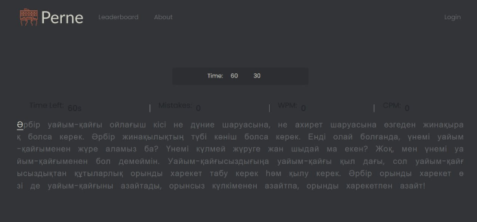
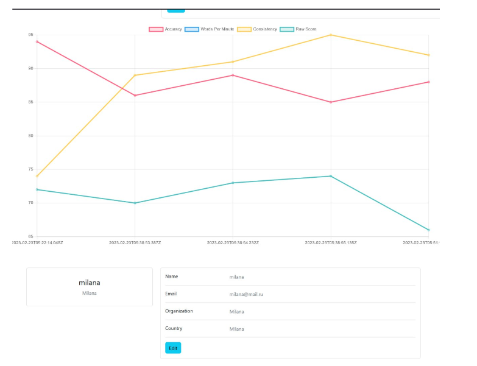

# Touch Typing Website based on Node.js and Mongodb on kazakh layout

Blind typing website for training kazakh layout on keyboard. The project has 2 mods (30s and 60s), progress chart on profile page, friends-request system, and simple authorization. Users and stats of typing tries are saved on MongoDB database.

 

## How to install and run

You need to install node.js on your system - [Node.js](https://nodejs.org/en/download/ "Node.js").

Then download the ZIP file or clone the project:
```
git clone https://github.com/dikxarper/touch-typing-express-mongodb.git
```
Access the cloned directory with:
```
cd touch-typing-express-mongodb
```
Install the dependencies with:
```
npm install <dependencies>
```

In order to run the project install `nodemon` library and run:
```
npm run devStart
```
